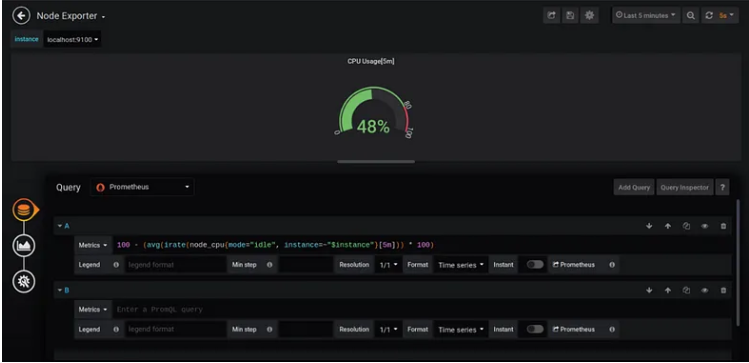
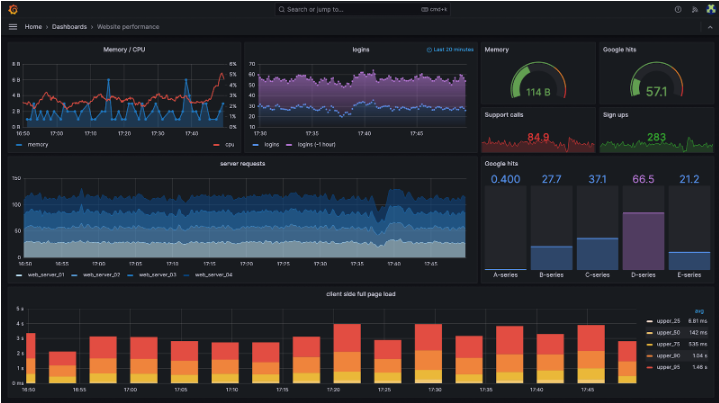
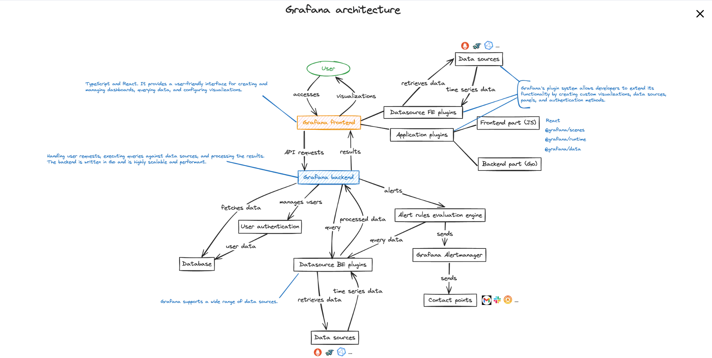

# Grafana

## Table of Conent

## Table of Contents

1. [What is Grafana?](#what-is-grafana)
2. [Why is Grafana Widely Used?](#why-is-grafana-widely-used)
3. [What Features Does Grafana Have?](#what-features-does-grafana-have)
4. [What Data Sources Does Grafana Support?](#what-data-sources-does-grafana-support)
5. [Grafana Core Components: Dashboards and Panels](#grafana-core-components-dashboards-and-panels)
6. [How Grafana Works: From Data Source to Dashboard](#how-grafana-works-from-data-source-to-dashboard)
	- [1. Data Source Plugin](#1-data-source-plugin)
	- [2. Query](#2-query)
	- [3. Transformation (Optional)](#3-transformation-optional)
7. [Grafana Architecture](#grafana-architecture)
8. [What is Grafana Cloud?](#what-is-grafana-cloud)
9. [What is Grafana Enterprise?](#what-is-grafana-enterprise)
10. [What is Prometheus Grafana?](#What-is-Prometheus-Grafana?)
11. [Common Use Cases of Grafana](#Common-Use-Cases-of-Grafana)
12. [Limitations of Grafana](#Limitations-of-Grafana)
13. [References](#References)

In today's fast-paced digital landscape, the ability to monitor and observe the health and performance of applications and infrastructure is not just beneficial—it's essential. As systems grow increasingly complex and the volume of data continues to skyrocket, organizations are faced with the challenge of not just managing this information but making sense of it. This is where Grafana steps in.

## What is Grafana?

Grafana is an open-source visualization and monitoring platform developed by Grafana Labs. It allows you to query, visualize, alert on, and understand your data from various data sources through highly customizable dashboards. 

## Why is Grafana Widely used?

Today, almost every application stack usually consists of a number of different applications, each performing a specific role and working together towards a common goal. The larger your stack, the more applications you need to monitor to ensure your infrastructure is healthy. This would lead to collecting large amounts of performance data on your application. You would then require a massive amount of effort to parse through and make sense of this data, which is not a pretty task without the right tool.

Grafana was made exactly for this purpose!

Grafana is an open-source analytics and interactive visualization web application. It allows you to ingest data from a huge number of data sources, query this data, and display it on beautiful customizable charts for easy analysis.

It is also possible to set alerts so you can quickly and easily be notified of abnormal behavior and lots more. In simple terms, Grafana allows you to transform the mountain of performance metric data collected from your applications, into visualizations. This will allow you to draw conclusions and make decisions to keep your application stack healthy.

Here are three key reasons why Grafana has gained significant popularity and widespread adoption among organizations of all sizes and industries:

- Fast: Grafana is known for its exceptional performance. The backend of Grafana is powered by Go, a programming language renowned for its speed and efficiency. Go's lightweight nature and native compilation enable Grafana to handle large volumes of data and render visualizations quickly. This means that even when dealing with massive datasets and complex dashboards, Grafana remains responsive and provides a smooth user experience.

- Versatile: Grafana follows a plugin architecture, which allows users to extend its functionality and integrate with a wide range of data sources. Whether you are working with NoSQL/SQL databases, project management tools like Jira, or CI/CD tools like GitLab, Grafana has you covered. 

   Beyond data source plugins, Grafana also supports panel plugins for custom visualization types and app plugins that add new features and integrate applications directly into the Grafana ecosystem. This extensive collection of plugins ensures that Grafana can seamlessly integrate with your existing infrastructure and provide a unified view of your data.

- Open-source: Grafana is an open-source software. This means that you have cosmplete access to the source code, allowing you to inspect, modify, and contribute to the project.

## What features does Grafana have?

Grafana comes with a plethora of features that provide value straight out of the box. These features are the reason Grafana is arguably one of the most popular visualization software available for metric monitoring, simply because of their ease of use:

### 1. Visualization

Grafana possesses a huge variety of visualization options to help you view and understand your data easily. These options are split into “panels” which are then used to build the Grafana dashboard.
A panel is the most granular visualization building block in Grafana and is used to display data that has been queried from the data source attributed to that panel. For easier understanding, think of a panel as a space on the dashboard that houses a specific type of visual portrait of information.
This information is being pulled from the data source attributed to that panel and can be a type of graph (gauge, histogram, bar chart, etc.), or logs and alerts. For example, one could create a gauge panel with its data source set to Prometheus, and then query CPU usage data stored in Prometheus to be displayed on this panel. Such a panel would look like this:

You could stack up panels like this to make up a dashboard, with each panel displaying its own piece of information in the manner that best suits you. Worthy of note is the fact that although Grafana ships with some pretty cool panels, you could design and add your own panels using plugins — the power of Open Source.

### 2. Alerting

When monitoring applications, it is essential to be made aware the second something goes wrong or is abnormal. This is vital to keeping your systems healthy and reducing downtime. Grafana has built-in support for a huge number of notification channels, be it email, Slack, PagerDuty, etc., whichever best suits you.

In order to create an alert, you’d have to create and configure an alert rule. This rule serves as a trigger for your alert, such that whenever said rule is broken, an alert notification is sent via the alert notification channel you had configured into the rule. For a more detailed look into Grafana alerts, look no further than this MetricFire article — Grafana alerting.

### 3. Annotations

Grafana allows you to annotate, or in simple terms, leave notes directly on graphs. This simple but powerful feature provides a way to seamlessly mark important points on your graph. This serves as a reminder for further action in the future, to provide context to an onboarding team member, or to simply mark a special event on your graph.

Think of it as writing a sticky note and placing it directly on your graph, but this time, you don’t need any sticky note papers. Further information on annotations can be found in our Grafana annotations tutorial article (yes, we have articles for everything Grafana!).

### 4. Open Source

Grafana is completely open source and backed by an active vibrant community. This presents some huge benefits to its users such as the flexibility to develop and publish their own plugins or use plugins developed by other people. These plugins are usually easy to install by pretty much downloading the source code and running it manually.

## What Data sources does Grafana have?

Grafana is a tool used to analyze and visualize data. However, this data would have to be stored somewhere in order for Grafana to access and display it. These databases are what we refer to as data sources, and a Grafana datasource is simply any database from which it can pull data.

All you have to do is create a connection between your Grafana instance and that data source and provide a data query. Grafana would then pull and display data from this data source at predefined/configurable intervals based on the query provided. Each data source supported by Grafana has a specific query editor for an optimal query writing experience.

It can be customized for the capabilities and features peculiar to that data source, with some of these editors having an autocomplete feature. You could also display data from multiple data sources on a single dashboard. This can be achieved in a couple of ways.

## Grafana Core Components: Dashboards and Panels

At the heart of Grafana’s user interface are dashboards and panels. Dashboards provide a visual representation of data and are composed of individual panels arranged in a grid. 
The following image illustrates a sample Grafana dashboard that provides a comprehensive snapshot of website performance metrics:

Panels are the building blocks of a Grafana dashboard, serving as containers for visualizing data. In the example dashboard above, there are nine distinct panels (highlighted in yellow) displaying various metrics and data points.

Panels offer a wide range of visualization formats to present data in meaningful ways, such as:

- Time series graphs
- Stats and gauges
- Tables
- Heatmaps and histograms
- Alert lists
- And many more...
	
Each panel can display data from one or more data sources, enabling you to combine and correlate metrics from different systems in a single view.

One of the key strengths of panels is their deep customization options. Beyond choosing data sources and visualization types, panels provide a rich set of configuration settings to fine-tune every aspect of their appearance and behavior.

Some common panel customization options include:

- **Queries and data transformations:** Grafana's query editor allows you to extract and manipulate data from each data source. This enables complex data transformations to be performed on the data before visualization.
- **Display options:** Grafana provides various options to customize the appearance of panels. You can adjust the panel's size, title, background, borders, and other visual properties to achieve the desired look and feel.
- **Field and override options: You can dynamically set colors, thresholds, value mappings, links, and more based on the data being displayed.
- **Thresholds and alerts:** You can define thresholds on the data to set boundaries for specific values or ranges. Additionally, you can configure rules that trigger alerts when certain conditions are met.

By leveraging these customization options, you can create highly tailored, informative, and interactive dashboards that provide valuable insights into your systems and infrastructure.

## How Grafana Works: From Data Source to Dashboard

In Grafana, the process of getting data from a data source and displaying it on a dashboard involves three main steps: 

### 1 Data Source Plugin
A data source plugin in Grafana is a connector that allows Grafana to communicate with a specific data source. Grafana supports various types of data sources, such as databases (e.g., MySQL, PostgreSQL), time series databases (e.g., Prometheus, InfluxDB), cloud services (e.g., AWS CloudWatch, Google Cloud Monitoring), and more.
Each data source has its own plugin that defines how Grafana interacts with it, This includes how to establish a connection, authenticate, and retrieve data. Given that each data source can have its own query language, authentication method, and data format, the plugin plays a crucial role in reconciling these differences. It understands the specifics of the data source and translates requests from Grafana’s query editor into queries that the data source comprehends. Once the data is retrieved, the plugin converts it into a data frame, a unified data structure used by Grafana to standardize and represent data internally.
The plugin acts as the first step in the data transformation process, enabling Grafana to connect to and fetch data from the desired data source.

### 2 Query
Once Grafana is connected to a data source through the plugin, you need to specify a query to retrieve the desired data.
A query is a request for specific data from the data source. It defines what data you want to retrieve and how you want to filter or aggregate it. The query language and syntax may vary depending on the data source. For example, SQL databases use SQL queries, while Prometheus uses its own query language called PromQL.
The query acts as the second step, allowing you to select and filter the data you want to visualize in your dashboard.

### 3 Transformation (optional)
After the data is retrieved from the data source using the query, you have the option to apply transformations to the data before it is visualized on the dashboard. 
Transformations are operations that modify or enhance the queried data. They allow you to perform calculations, aggregations, filtering, or other manipulations on the data. Grafana provides a set of built-in transformations, such as renaming fields, filtering rows, joining data from multiple queries, calculating new fields, and more. 
The transformation step acts as the third and final step, enabling you to refine and customize the data before it is displayed on the dashboard.

After the data passes through these three steps (data source plugin, query, and optional transformation), it is ready to be visualized on the Grafana dashboard.

Grafana Architecture

 
 

The diagram shows the Grafana architecture, which is how Grafana works to display and manage data. Here's a simple explanation:

- **User:** A user interacts with Grafana to view visualizations and manage dashboards.
- **Grafana Frontend:** This part of Grafana is what the user sees (the interface). It’s built using React and handles creating the dashboards and sending data requests.
- **Grafana Backend:** The backend is written in Go and is responsible for processing requests from the frontend, getting data from data sources, managing users, and handling alerts.
- **Data Sources:** Grafana doesn't store data itself. It connects to external systems (like databases or time-series data sources) to retrieve the data it needs.
- **Plugins:** Grafana uses plugins to connect to different data sources and allow for custom visualizations and features. There are two types of plugins:
- **Frontend Plugins:** Used to show data on the dashboard.
- **Backend Plugins:** Used to pull data from sources.
- **Alerting System:** Grafana also has an alerting engine. It checks data against rules and sends alerts if something important happens. It can send alerts via email, Slack, or other tools using Grafana Alertmanager.
- **User Authentication:** Grafana checks and manages users, ensuring only authorized users can access or modify the dashboards and data.

In summary, Grafana connects to external data sources, processes data through its backend, and shows it to the user in dashboards using the frontend. It can also handle user access and send alerts.

## What is Grafana Cloud?

Grafana Cloud is a cloud-native, highly available, performant fully managed open SaaS (Software-as-a-Service) metrics platform. Pretty helpful for those who do not want to take the load of hosting the solution on-prem and want to stay worry-free about managing the entire deployment infrastructure.

## What is Grafana enterprise?

The enterprise service comes with all the Grafana Cloud features plus premium plugins, data sources and premium support from the core team. We get response SLAs, training and a lot more. For more information visit.

## What is Prometheus Grafana?

Prometheus is an open-source data monitoring tool. The combination of Prometheus and Grafana is the de-facto combination leveraged in the industry for deploying a data visualization setup. Grafana dashboard is used for visualizing the data whereas the backend is powered by Prometheus.

Though Prometheus too has data visualization features still, Grafana is preferred for visualizing data. Queries are fired from the Grafana dashboard and the data is fetched from Prometheus.
It acts as a perfect open-source data model for storing time series data.

## Common Use Cases of Grafana

1. **Infrastructure Monitoring:** Grafana is widely used to monitor systems like servers, networks, and storage. It helps track important metrics like CPU usage, memory, and network traffic. You can also set alerts, for example, if CPU usage goes above 80%. This helps in identifying problems and predicting future needs.

2. **Application Performance Monitoring (APM):** Grafana helps monitor application health, especially in complex systems. It shows how requests move through different services, making it easier to spot slowdowns or errors. It also helps track logs and performance data to identify and fix issues faster.

3. **Business Intelligence and Analytics:** Grafana is not just for technical users. It can be used to track business data like sales, revenue, and customer stats. Companies use it for real-time dashboards that show key business metrics or reports for management.

## Limitations of Grafana

Grafana is a powerful tool for data visualization and monitoring, but it has certain limitations that you should consider:

1. **Limited Built-in Alerting**

**Issue:** While Grafana provides alerting capabilities, its built-in alerting system is relatively basic compared to dedicated tools like Prometheus Alertmanager.

**Limitation:** It lacks advanced alerting features such as routing, silencing, and deduplication, which are crucial for managing complex alerting scenarios.

2. **Dependency on Data Sources**

**Issue:** Grafana relies on external data sources (e.g., Prometheus, InfluxDB, etc.) for storing and querying data.

**Limitation:** It does not store data natively, making it dependent on the availability, performance, and query capabilities of the connected data sources.

3. **Limited Support for Large-Scale Environments**

**Issue:** Grafana might struggle in environments where large volumes of data need to be visualized or queried.

**Limitation:** Dashboards with high-frequency queries or extensive data points can suffer from performance issues, causing slow loading times or timeouts.

4. **Complexity in Dashboard Management**

**Issue:** Managing multiple dashboards with various panels and data sources can become complex and difficult to maintain.

**Limitation:** There is no native, centralized way to manage dashboard templates or configurations for large teams, leading to fragmented or inconsistent dashboards.

5. **Limited Support for Role-Based Access Control (RBAC)**

**Issue:** While Grafana Enterprise provides more advanced RBAC, the open-source version has limited options for managing granular permissions.

**Limitation:** For organizations that need fine-grained access control, the open-source version may not be sufficient.

6. **Learning Curve**

**Issue:** For beginners, Grafana’s interface and setup process can be somewhat overwhelming.

**Limitation:** Users need to understand its data source integrations, panel configurations, and query languages, which can require considerable time to learn.

7. **Limited Annotation Features**

**Issue:** Annotations in Grafana are useful for marking specific events on dashboards, but they are somewhat limited.

**Limitation:** It does not support complex or automatic annotations based on external triggers or predefined rules, limiting flexibility in tracking events.

8. **Requires Manual Configuration for Advanced Features**

**Issue:** While Grafana offers customization options, advanced features like custom plugins, themes, and complex alerts require manual configuration.

**Limitation:** For advanced users, configuring these features may require significant time and effort, with limited out-of-the-box support.

9. **Scaling and Performance Issues**

**Issue:** Large-scale deployments, such as when monitoring thousands of servers, can cause Grafana to struggle with performance.

**Limitation:** There may be limitations in terms of scaling the application horizontally, leading to higher infrastructure costs or performance bottlenecks.

10. **Limited Data Export Capabilities**

**Issue:** Grafana offers minimal data export options for users who want to analyze data outside the platform.

**Limitation:** Exporting data in bulk for offline analysis or integration with other platforms is not as seamless as in some other tools.

11. **High Memory Usage for Large Dashboards**

**Issue:** Visualizing multiple data points or complex dashboards can lead to high memory consumption.

**Limitation:** On resource-constrained systems, this may result in performance degradation or crashes during heavy usage.

# References

https://medium.com/@MetricFire/what-is-grafana-8de44d241765

https://kodekloud.com/blog/how-grafana-works/
https://scaleyourapp.com/what-is-grafana-why-use-it-everything-you-should-know-about-it/
